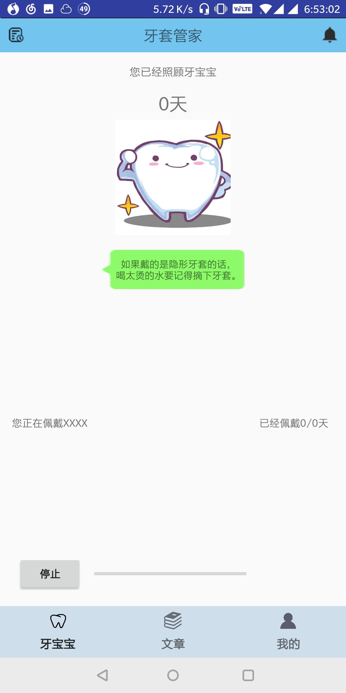
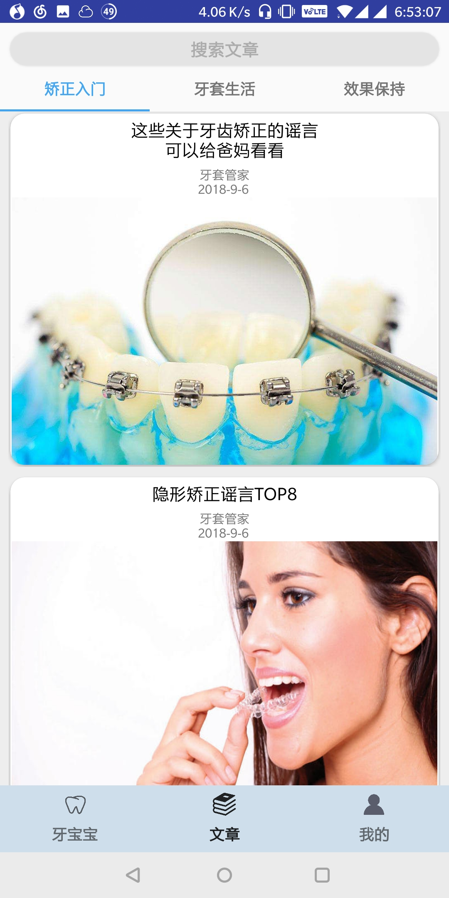
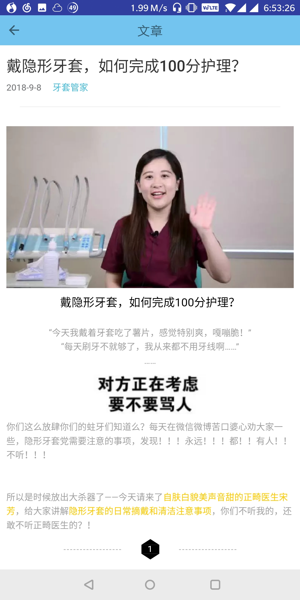
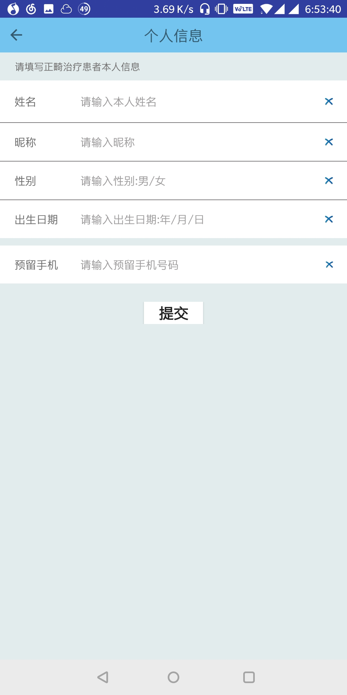

# awesome-MedicalAndroidApp
## Introduction

Awesome-MedicalAndroidApp is born for patients, who want to take good care of their teeth. It is an android app and is connected to the database which is deployed on the LeanCloud Server.

## Features

- **Self-Diagnosis:** If you don't know whether you should straightening your teeth, you can use this module. You can take photos of your teeth in different perspectives and send to the dentists together with your personal information and descriptions about your teeth.
- **Notification:** You can see your diagnosis message in the notification module.
- **Calendar:** Don't forget to sign in, or the color of the corresponding date will be red to warn you about it.
- **Timer Notification:** If you wear the retainer, you'll receive the notification in the evening, maybe 22:00.
- **Articles:** You can see many articles related to Orthodontics in the page module, and you can also search the articles you want.
- **Tips:** You can see many useful tips if you click the teeth baby according to the hint.
- **Personal information:** You can fill in the information about youself and wearing, which will be shown in the teeth baby module.
- **Timer and Histogram:** If you wear the invisual brace, you may be worried that you always want to know whether the time you have already wear is up to 22 hours or not. Try this module! You can see the daily process in the processing bar and you can see the weekly data in the histogram.

## Demo

## Technique Support

- LeanCloud API

